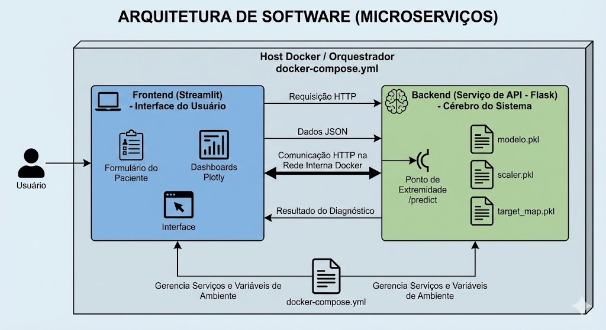
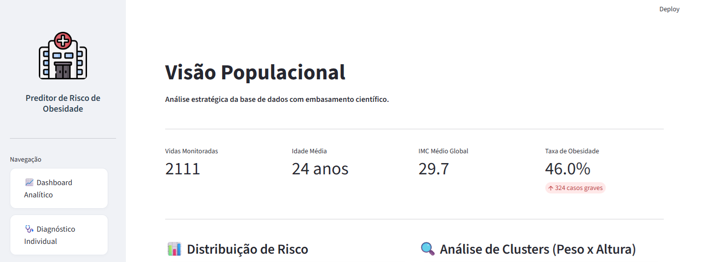
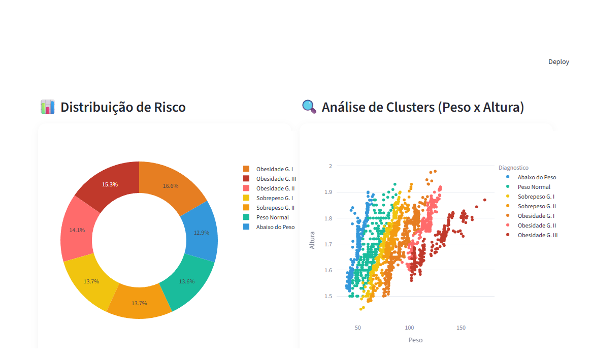
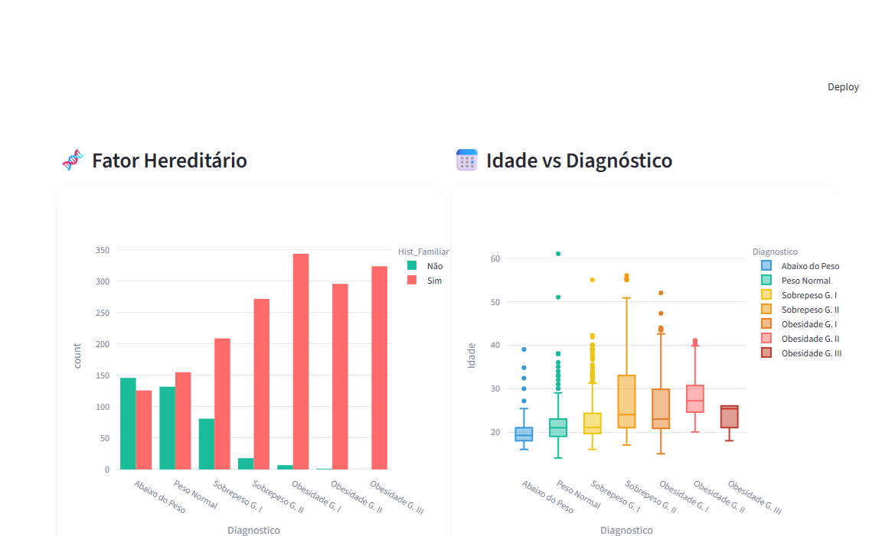
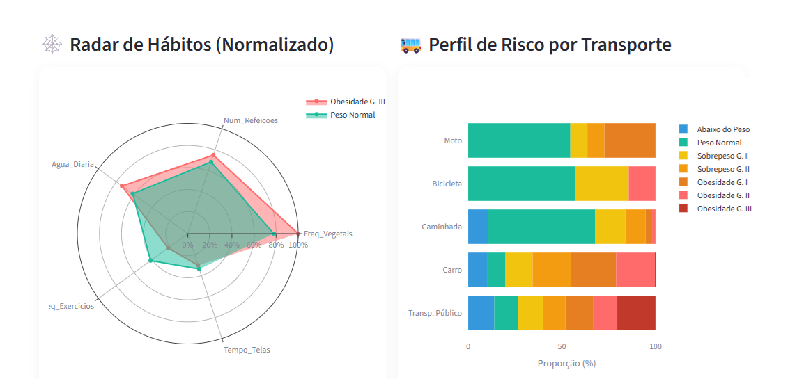
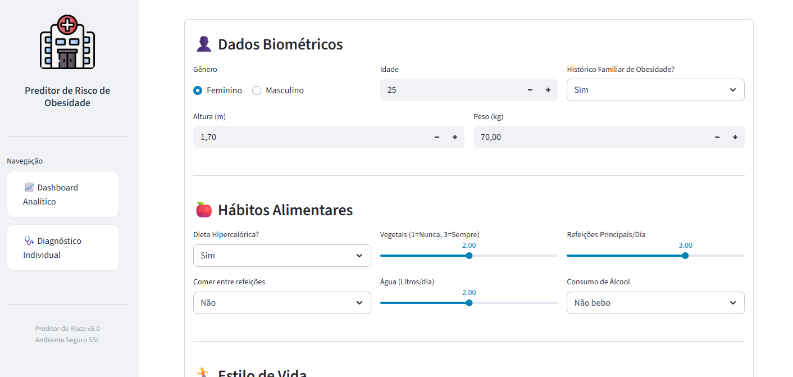
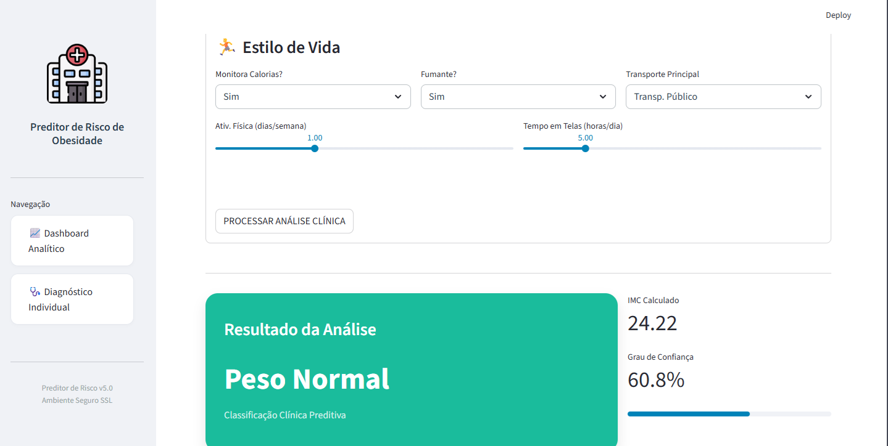

# 🧬 Preditor de Risco de Obesidade

Este projeto é a entrega oficial da **Fase 4 do Tech Challenge (FIAP)**, a solução integra Engenharia de Dados e visão clínica para oferecer uma ferramenta robusta de suporte à decisão médica no monitoramento da obesidade.

[](https://preditor-de-risco-de-obesidade-adb5lkuptneqh6hkq83d9f.streamlit.app/)

---

## 🔬 Diferenciais da Solução

Diferente de preditores comuns, esta aplicação foca na **Prevenção Ativa**:
* **Risco Metabólico Acumulado:** O algoritmo calcula a probabilidade estatística de todas as faixas de risco, gerando alertas precoces mesmo para pacientes com IMC normal.
* **Fundamentação Científica:** Dashboards integrados com correlações baseadas em evidências da *Nature Portfolio*, *CDC* e *BMJ*.
* **Perfil Atlântico:** Lógica implementada para mitigar falsos positivos em indivíduos com alta massa muscular (atletas).
---

## 🤖 Desenvolvimento da Inteligência Artificial

Para garantir a **viabilidade clínica** em ambientes hospitalares, o modelo passou por um rigoroso processo de refinamento técnico:

### ⚙️ Treinamento e Otimização
* **Dataset:** 1.688 registros com 19 variáveis comportamentais e genéticas.
* **Algoritmo:** Random Forest Classifier.
* **Tuning:** Implementação de `GridSearchCV` com 5-fold cross-validation (40 combinações testadas).
* **Estratégia Anti-Overfitting:** Aplicamos **Regularização Agressiva (Pruning)**, limitando a profundidade das árvores e estabelecendo um mínimo de amostras por folha para garantir que o modelo identifique padrões reais e não apenas "decore" a base de dados.

### 📊 Performance Final
| Métrica | Resultado |
| :--- | :--- |
| **Acurácia (CV)** | 81.10% (+/- 4.39%) |
| **Precisão Média** | 85.43% |
| **AUC Score Global** | 0.9824 |
| **Acurácia de Treino** | 90.54% |

> **Conclusão Técnica:** Reduzimos o aprendizado viciado de 100% para 85% no conjunto de treino, equilibrando a balança para um modelo generalista e confiável para novos pacientes.

---

## 🏗️ Arquitetura da Solução
A solução utiliza uma arquitetura containerizada, separando o Frontend (Streamlit) da lógica de Machine Learning (API Flask).



---

## 🖼️ Interface e Funcionalidades

### 1. Dashboard Executivo e Clusters
Visão macro da população monitorada com KPIs de saúde e análise de correlação Peso x Altura.
 

### 2. Fatores Clínicos e Estilo de Vida
Análise do impacto da genética e radar de hábitos comparativo (Saudável vs Obesidade).
 

### 3. Prontuário Digital e Diagnóstico IA
Formulário intuitivo para inserção de dados e resultado em tempo real com cálculo de risco acumulado.
 

---

## 🛠️ Tecnologias Utilizadas

* **Linguagem:** Python 3.9+
* **Data Science:** Scikit-learn, Pandas, Numpy
* **Visualização:** Plotly Express & Graph Objects
* **Web/API:** Streamlit & Flask
* **DevOps:** Docker & Docker Compose

---

## 🚀 Como Executar

1. **Clone o repositório:**
   ```bash
   git clone [https://github.com/J034ll4n/Preditor-de-Risco-de-Obesidade.git](https://github.com/J034ll4n/Preditor-de-Risco-de-Obesidade.git)
   cd Preditor-de-Risco-de-Obesidade